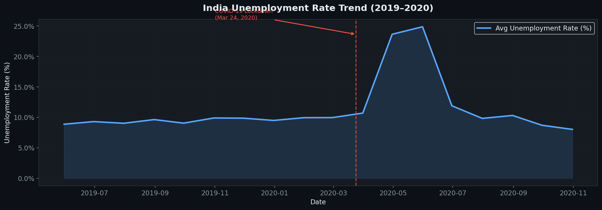

# 📊 Unemployment Analysis in India (2019–2020)
### Impact of COVID-19 on India's Labour Market

<p align="center">


> **CodeAlpha Data Science Internship | Task 2**  
> Deep analysis of India's unemployment data before and during the COVID-19 pandemic using Python.

---

## 🎯 Project Objectives

- Analyze **unemployment rate trends** across 28 Indian states (2019–2020)
- Quantify the **impact of COVID-19 lockdown** (March 24, 2020) on employment
- Explore **Rural vs Urban** unemployment disparities
- Identify **high-risk states** through state-level comparison
- Extract actionable insights for **economic & social policy**

---

## 📁 Project Structure

```
unemployment-india-analysis/
│
├── 📂 data/
│   ├── Unemployment_in_India.csv              # Pre-2020 data (768 rows, Rural/Urban split)
│   └── Unemployment_Rate_upto_11_2020.csv     # Jan–Oct 2020 (267 rows, with geo-coords)
│
├── 📂 notebooks/
│   └── Unemployment_Analysis_India.ipynb      # ⭐ Main analysis notebook
│
├── 📂 outputs/                                # All generated visualizations
│   ├── 01_national_trend.png
│   ├── 02_state_unemployment.png
│   ├── 03_rural_vs_urban.png
│   ├── 04_covid_impact.png
│   ├── 05_lpr_heatmap.png
│   ├── 06_top5_states.png
│   ├── 07_employed_trend.png
│   └── 08_correlation.png
│
├── requirements.txt
└── README.md
```

---

## 📊 Key Visualizations

| Chart | Description |
|-------|-------------|
| `01_national_trend` | India-wide unemployment timeline with COVID annotation |
| `02_state_unemployment` | State-wise average unemployment (ranked bar chart) |
| `03_rural_vs_urban` | Rural vs Urban time series + distribution comparison |
| `04_covid_impact` | Pre vs Post lockdown comparison across states |
| `05_lpr_heatmap` | Labour Participation Rate heatmap by state & month |
| `06_top5_states` | Timeline of 5 most COVID-impacted states |
| `07_employed_trend` | Total employed workforce trend (in Crores) |
| `08_correlation` | Correlation matrix of key labour indicators |

---

## 🔍 Key Findings

| # | Finding |
|---|---------|
| 🔴 | National unemployment **spiked from ~8% → 23.5%** within 4 weeks of lockdown (April 2020) |
| 🟡 | **Urban unemployment** consistently higher than rural due to informal sector dependence |
| 🟠 | **Haryana, Tripura, Jharkhand** had highest unemployment even pre-COVID |
| 📉 | Approx. **12+ Crore workers** dropped out of the active labour force at peak lockdown |
| 📈 | Recovery began post-June 2020, but remained above pre-COVID levels |
| 🔗 | Strong positive correlation between Labour Participation Rate and Employed workforce |

---

## 🛠️ Tech Stack


---

## 🚀 Quick Start

```bash
# 1. Clone the repository
git clone https://github.com/YOUR_USERNAME/unemployment-india-analysis.git
cd unemployment-india-analysis

# 2. Install dependencies
pip install -r requirements.txt

# 3. Launch Jupyter Notebook
jupyter notebook notebooks/Unemployment_Analysis_India.ipynb
```

---

## 📦 Dataset Info

| Feature | Description |
|---------|-------------|
| `Region` | Indian state name |
| `Date` | Month-end date |
| `Estimated Unemployment Rate (%)` | % of labour force unemployed |
| `Estimated Employed` | Absolute count of employed individuals |
| `Estimated Labour Participation Rate (%)` | % of working-age population in labour force |
| `Area` | Rural / Urban (Dataset 1 only) |
| `longitude`, `latitude` | Geo-coordinates (Dataset 2 only) |

**Source:** [CMIE (Centre for Monitoring Indian Economy)](https://unemploymentinindia.cmie.com/)

---

## 💡 Policy Recommendations

1. **Urban Safety Nets** — Portable social security for urban informal sector workers
2. **MGNREGA Expansion** — Extend rural job guarantee to urban areas during crises
3. **State Interventions** — Targeted programs for high-unemployment states (Haryana, Tripura, Jharkhand)
4. **Reskilling** — Digital & services sector upskilling for post-pandemic labour market
5. **Real-time Monitoring** — Monthly granular employment tracking as national policy

---


